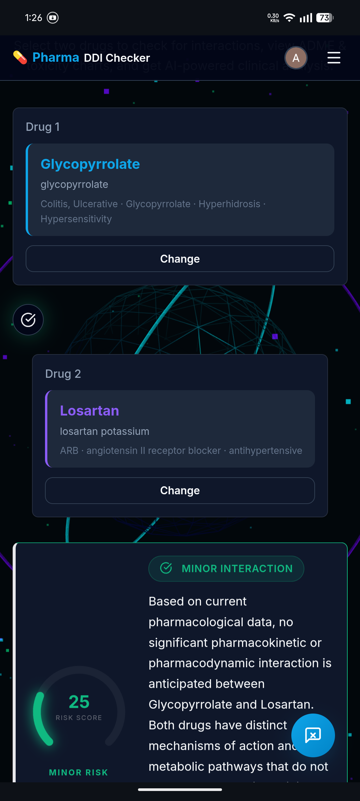
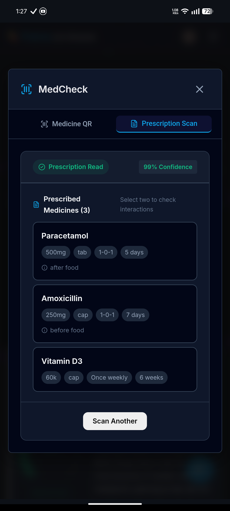
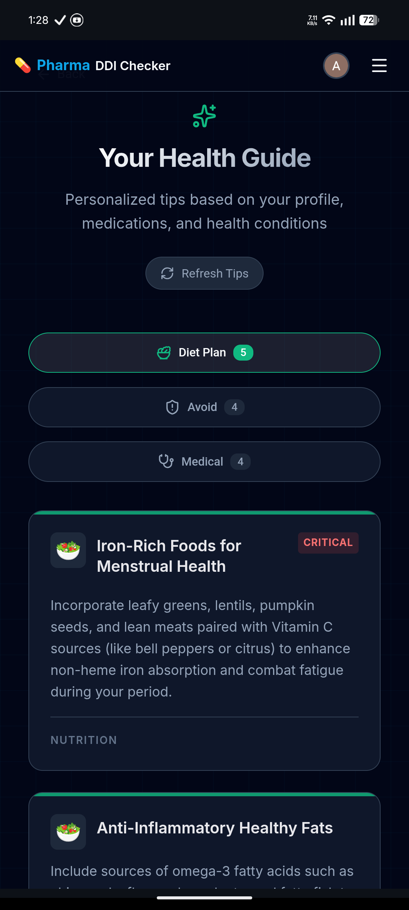
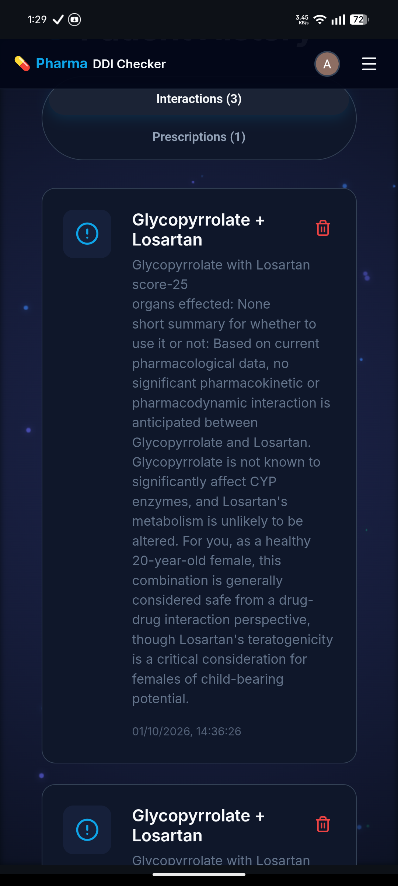

<div align="center">
  
  
  # Pharma DDI Checker
  
  **Next-Gen Pharmacovigilance & AI-Powered Drug Interaction Analysis**
  
  [](https://nextjs.org/)
  [](https://deepmind.google/technologies/gemini/)
  [](https://neon.tech/)
  [](https://opensource.org/licenses/MIT)

</div>

<br />

Pharma DDI Checker is an advanced, AI-driven healthcare platform designed to provide evidence-based Drug-Drug Interaction (DDI) analysis. Built for healthcare professionals, pharmacologists, and patients, it combines cutting-edge AI (Google Gemini) with established pharmacological rules (KD Tripathi) to deliver comprehensive safety data, toxicity profiling, and clinical recommendations.

## ✨ Key Features

- 🧬 **Intelligent DDI Analysis**: Real-time checks for drug interactions utilizing verified databases, ADME profiling, and enzyme kinetics.
- 📊 **Toxicity Radar Charts**: Visualizes combined risks for hepatotoxicity, nephrotoxicity, cardiotoxicity, and neurotoxicity.
- 🤖 **Aastha AI Chatbot**: A dedicated AI medical assistant to answer complex pharmacological queries directly from interaction reports.
- 📷 **Prescription OCR Scanner**: Instantly scan and digitize prescription images to automatically extract and analyze medicines using Gemini Vision.
- 💧 **Skincare AI Assistant**: Specialized dermatology insights and routine checks.
- 📅 **Menstruation Cycle Tracker**: Predictive tracking with tailored health tips.
- 🔔 **Medication Reminders**: Push notification system to keep track of daily dosages.
- 👥 **Role-Based Workflows**: Tailored user experiences depending on whether you are a patient, doctor, or pharmacologist.

## 📸 Screenshots

| Dashboard | Prescription Scan |
| :---: | :---: |
|  |  |

| Health Tips | History & Reports |
| :---: | :---: |
|  |  |

## 🛠️ Tech Stack

- **Framework**: [Next.js 14 (App Router)](https://nextjs.org/)
- **Language**: TypeScript
- **Styling**: Vanilla CSS (CSS Modules & Globals)
- **Database**: [Neon Postgres](https://neon.tech/) with Prisma ORM
- **Authentication**: NextAuth.js (Google OAuth)
- **AI Integration**: Google Gemini API (Pro & Vision)
- **Animations**: Framer Motion & React Three Fiber (WebGL)
- **Charts**: Chart.js (`react-chartjs-2`)

## 🚀 Getting Started

### Prerequisites
- Node.js (v18 or higher)
- PostgreSQL Database URL (e.g., via Neon)
- Google Gemini API Key
- Google OAuth Credentials

### Installation

1. **Clone the repository**
   ```bash
   git clone https://github.com/ashugit1234622/Pharma-ddi-checker.git
   cd Pharma-ddi-checker
   ```

2. **Install dependencies**
   ```bash
   npm install
   ```

3. **Set up Environment Variables**
   Create a `.env` file in the root directory based on `.env.example` and add your keys:
   ```env
   DATABASE_URL="postgresql://..."
   GEMINI_API_KEY="..."
   NEXTAUTH_URL="http://localhost:3000"
   NEXTAUTH_SECRET="..."
   GOOGLE_CLIENT_ID="..."
   GOOGLE_CLIENT_SECRET="..."
   ```

4. **Initialize Database**
   ```bash
   npx prisma db push
   npm run seed
   ```

5. **Start the Development Server**
   ```bash
   npm run dev
   ```
   Open [http://localhost:3000](http://localhost:3000) to view it in your browser.

## 🤝 Contributing

Contributions, issues, and feature requests are welcome! Feel free to check the [issues page](https://github.com/ashugit1234622/Pharma-ddi-checker/issues).

## 📄 License

This project is licensed under the MIT License - see the LICENSE file for details.

---
<div align="center">
  <sub>Built with ❤️ for a safer healthcare ecosystem.</sub>
</div>
